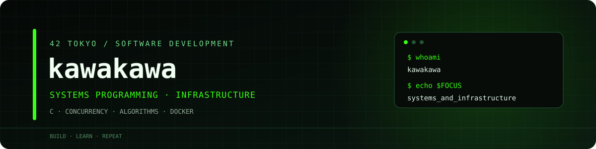
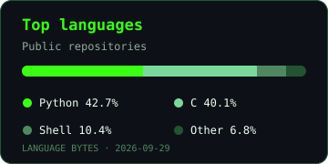

  

  
  
  
  

## 🟢 About

42 Tokyoのプロジェクトを通じて、Cのシステムプログラミング、並行処理、アルゴリズム設計、Dockerを使ったインフラ構築に取り組んでいます。

I build software through hands-on projects, with a focus on C, concurrency, algorithms, and containerized infrastructure.

- **Name** — kawakawa
- **Learning** — 42 Tokyoのカリキュラムを通じて、C・Python・システムプログラミング・インフラを学習しています。
- **Focus** — メモリ管理、共有リソースの同期、ソート・迷路生成アルゴリズム、コンテナによるサービスの分離。
- **Code** — 学習課題と実装を [42Tokyocursus](https://github.com/kawakawa42Tokyo202604/42Tokyocursus) にまとめています。

**Tech used in projects**

| Category | Technologies |
| --- | --- |
| Languages | C / Python / Shell |
| Systems | Linux / POSIX Threads / ファイルディスクリプタ / メモリ管理 |
| Infrastructure | Docker / Docker Compose / NGINX / WordPress / PHP-FPM / MariaDB / Redis |
| Development | Git / Make / mypy / flake8 / GitHub Actions |

## 🟢 Featured projects

- **[Codexion](https://github.com/kawakawa42Tokyo202604/42Tokyocursus/tree/main/codexion)** — C / POSIX Threads 
  共有ドングルを使うコーダーのマルチスレッドシミュレーション。mutex・条件変数による同期、取得順序によるデッドロック防止、FIFO / EDFの優先順位付け、期限の監視とログの直列化を扱います。
- **[Inception](https://github.com/kawakawa42Tokyo202604/42Tokyocursus/tree/main/Inception)** — Docker / Docker Compose / Shell 
  NGINX・WordPress・MariaDBを個別の自作イメージで動かすWebインフラ。TLS、ネットワーク分離、シークレット管理、データの永続化に加え、Redis・FTP・Adminer・定期バックアップと復元検証を組み合わせています。
- **[push_swap](https://github.com/kawakawa42Tokyo202604/42Tokyocursus/tree/main/push_swap)** — C / Sorting algorithms 
  2つのスタックと限られた命令で整数列を整列する課題。Simple・Chunk・Radixの戦略を実装し、入力サイズや乱雑度に応じて選択します。`--bench`で命令数を測定し、ボーナスの`checker`で整列結果を確認できます。
- **[C projects](https://github.com/kawakawa42Tokyo202604/42Tokyocursus)** — C / Libraries / File I/O 
  `libft`では文字列・メモリ・連結リスト、`ft_printf`では書式解析と可変長引数、`get_next_line`ではバッファと読み取り状態の管理に取り組んでいます。

42 Tokyo project list / 課題一覧

| Project | Language / Technology | About |
| --- | --- | --- |
| [Piscine](https://github.com/kawakawa42Tokyo202604/42Tokyocursus/tree/main/piscine) | C / Shell | Cの基本文法、文字列・配列操作、Shell、Rush、BSQに取り組む課題群。 |
| [libft](https://github.com/kawakawa42Tokyo202604/42Tokyocursus/tree/main/libft) | C | 標準Cライブラリの基本関数、文字列ユーティリティ、連結リスト操作をまとめた自作ライブラリ。 |
| [ft_printf](https://github.com/kawakawa42Tokyo202604/42Tokyocursus/tree/main/ft_printf_1) | C | 書式指定文字列を解析し、文字列・数値・ポインタなどを出力する`printf`の一部を再実装。 |
| [get_next_line](https://github.com/kawakawa42Tokyo202604/42Tokyocursus/tree/main/get_next_line) | C | ファイルディスクリプタから1行ずつ読み取る関数。ボーナスでは複数の読み取り対象の状態を管理。 |
| [push_swap](https://github.com/kawakawa42Tokyo202604/42Tokyocursus/tree/main/push_swap) | C | スタック操作によるソート、複数戦略の選択、命令数の計測、`checker`による結果確認。 |
| [Python modules 00–10](https://github.com/kawakawa42Tokyo202604/42Tokyocursus/tree/main/PythonModule) | Python | 基本文法、オブジェクト指向、例外処理、ファイル入出力、パッケージ、Pydantic、デコレータを学ぶ課題群。 |
| [A-Maze-ing](https://github.com/kawakawa42Tokyo202604/42Tokyocursus/tree/main/A-maze-ing) | Python | 設定ファイルから迷路を生成し、入口から出口への経路を探索・出力するプログラム。 |
| [A-Maze-ing bonus](https://github.com/kawakawa42Tokyo202604/42Tokyocursus/tree/main/A-maze-ing-bonus) | Python | DFS / Kruskalの生成アルゴリズム切り替え、対話式の表示操作、再利用可能なパッケージ化。 |
| [Codexion](https://github.com/kawakawa42Tokyo202604/42Tokyocursus/tree/main/codexion) | C / POSIX Threads | 共有リソースの同期、FIFO / EDFの待ち行列、期限の監視を組み合わせた並行処理シミュレーション。 |
| [Inception](https://github.com/kawakawa42Tokyo202604/42Tokyocursus/tree/main/Inception) | Docker / Shell | 自作コンテナによるWebインフラと、TLS・永続化・キャッシュ・バックアップ・復元検証。 |

## 🟢 GitHub activity

  
  

